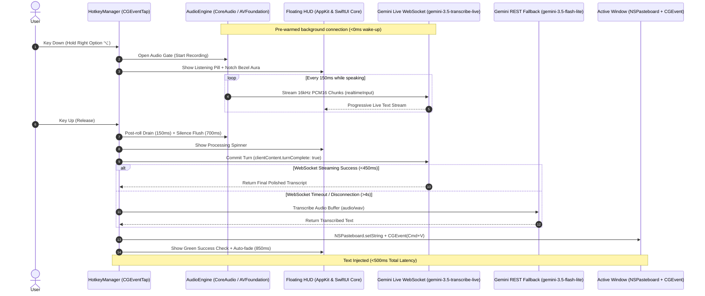

# JustSpeak 🎙️⚡

> **Ultra-Low-Latency Push-to-Talk macOS Voice Dictation & Text Polishing Engine**  
> *Native Swift • Apple CoreAudio Ring Buffer • Google Gemini Live WebSockets • Apple HIG Design*

> [!NOTE]
> **Built with Google / Gemini**: This project is built by a Googler as a technical demonstration and prototype showcasing ultra-low-latency bidirectional speech processing with Google's Gemini Live API. It is an independent open-source project and not an officially supported Google product.

---

## ⚡ Overview

**JustSpeak** is an ultra-fast, native macOS voice dictation tool engineered for zero-friction productivity. 

Hold down your global push-to-talk key (default: **Right Option ⌥**), speak naturally in English, Marathi, Hindi, or mixed code-switched speech, and release. JustSpeak streams 16kHz Linear PCM audio in real time directly to **Google Gemini 3.5 Transcribe Live** (`gemini-3.5-transcribe-live`) over bidirectional WebSockets, removes filler words (*um, uh, like*), normalizes numbers and dates, and injects polished text instantly into your active window via synthesized paste (`Cmd+V`) in **< 500ms**.

```
Hold [⌥ Right] ──► 🎙️ Audio Capture (16kHz PCM) ──► ⚡ Gemini Live STT ──► 📋 Cmd+V Paste (<500ms)
```

---

## ✨ Key Features

- **Sub-500ms End-to-End Latency**: Audio chunks are streamed over persistent WebSockets while you speak, so Gemini receives and transcribes speech before you even release the hotkey.
- **Zero Trailing Cutoff**: Engineered with a 150ms hardware post-roll grace period, synchronous queue drain, 700ms acoustic lookahead silence, and post-commit token settlement.
- **Apple HIG & Dynamic Island UI**:
  - **Notch Bezel Aura**: 3-layer Gaussian glow embracing your MacBook display notch.
  - **Siri Orb & Living Equalizer**: Pulsing Apple Intelligence gradient orb with 4-bar dynamic audio visualizer.
  - **Obsidian Dynamic Island Capsule**: Glassmorphic floating HUD rendered with Display P3 colors.
- **Apple System Earcons**: Pre-cached native macOS audio feedback on key-down and text commit (`begin_record.caf`, `jbl_confirm.caf`, `jbl_cancel.caf`).
- **Custom Vocabulary**: Domain terms, acronyms, team names, and tech stack jargon loaded from [`vocabulary.txt`](vocabulary.txt) or `.env`.
- **Bilingual & Code-Switching Support**: Built-in support for English (`en`), Marathi (`mr`), Hindi (`hi`), and 70+ languages with automatic acoustic language detection.
- **Zero Unsigned Binaries (gMac Enterprise Compliant)**: Pure Swift script executed directly through Apple's signed `/usr/bin/swift` interpreter with zero third-party binary dependencies.
- **Resilient Fallback Routing**: Automatic, transparent failover to Gemini REST API (`gemini-3.5-flash-lite` / `gemini-3.5-transcribe`) on WebSocket disconnection or timeouts.

---

## 🔒 Security & Enterprise Santa Policy Compliance

JustSpeak was designed specifically for corporate gMac environments with strict security baselines:

- **Zero Compiled Binaries**: No external Mach-O binaries, `.dylib` shared libraries, or native Node.js addons (`node-gyp`).
- **Apple-Signed System Runtimes Only**: Executes purely via macOS system frameworks (`AVFoundation`, `CoreAudio`, `CoreGraphics`, `AppKit`) and `/usr/bin/swift`.
- **Zero External Dependencies**: Self-contained single-file Swift implementation without package managers, CocoaPods, or dynamic linkers.
- **Zero Local Audio Persistence**: Raw microphone audio is held in memory buffers during the keypress and discarded immediately after dispatch.

---

## 🏗️ Architecture



---

## 🚀 Quick Start

### 1. Prerequisites
- **macOS 13.0+** (Ventura, Sonoma, Sequoia, or later).
- **Apple Command Line Tools** (provides `/usr/bin/swift`):
  ```bash
  xcode-select --install
  ```

### 2. Clone & Setup
```bash
# Clone the repository
git clone https://github.com/adhishthite/justspeak.git
cd justspeak

# Initialize local .env configuration
make setup
```

### 3. Configure API Key
Open `.env` and add your Google Gemini API key ([Get an API key from Google AI Studio](https://aistudio.google.com/)):
```ini
GEMINI_API_KEY=AIzaSy...
```

### 4. Verify Permissions & Connectivity
```bash
# Verify Accessibility, Microphone, and Input Monitoring permissions
make check-permissions

# Verify API key reachability and latency
make test-api
```

### 5. Run JustSpeak
```bash
make run
```
*Or use the runner script:*
```bash
./justspeak
```

---

## ⚙️ Configuration Reference (`.env`)

All settings can be configured in `.env` or set as environment variables:

| Variable | Default | Description |
| :--- | :--- | :--- |
| `GEMINI_API_KEY` | *(empty)* | Google Gemini API Key (**Required**) |
| `GEMINI_LIVE_MODEL` | `gemini-3.5-transcribe-live` | Real-time WebSocket streaming model |
| `GEMINI_MODEL` | `gemini-3.5-flash-lite` | REST fallback STT model |
| `SMART_TRANSCRIPTION` | `true` | Real-time Inverse Text Normalization ($26M, dates, formatting) and disfluency removal |
| `LANGUAGE_CODES` | `en-IN,mr-IN` | Region-qualified BCP-47 codes from the live-transcribe language table (e.g. `en-IN,mr-IN`, `en-US`, or `auto` for unrestricted) |
| `CUSTOM_VOCABULARY` | *(empty)* | Comma-separated list of words/phrases to boost |
| `CUSTOM_VOCABULARY_FILE` | `vocabulary.txt` | File containing one word/phrase per line (`#` comments allowed) |
| `HOTKEY` | `right_option` | Trigger key (`right_option`, `left_option`, `right_control`, `left_control`, `right_cmd`, `left_cmd`, `fn`, `f18`, `f19`, `f13`) |
| `HOTKEY_MODE` | `push_to_talk` | `push_to_talk` (hold to speak) or `toggle` (press to start, press to stop) |
| `SOUND_FEEDBACK` | `true` | Subtle Apple system earcons on start / commit |
| `SHOW_HUD` | `true` | Native floating Dynamic Island capsule + Apple Notch Bezel Aura |
| `ENABLE_LIVE_WEBSOCKET` | `true` | Stream audio chunks via Live WebSockets (`true`) or REST only (`false`) |
| `REST_FALLBACK_TIMEOUT` | `4.0` | Maximum seconds to wait for WebSocket response before falling back to REST |
| `POST_ROLL_MS` | `250` | Grace period (ms) after key release to catch the tail of the final word before finalizing (0-500) |
| `VAD_MODE` | `manual` | `manual` (push-to-talk hold defines speech bounds, server VAD off), `tuned` (pause-tolerant server VAD), `auto` (stock server VAD) |
| `VAD_SILENCE_MS` | `1500` | Tuned mode only: pause length (ms) before server VAD ends speech (200-5000) |
| `MIC_IDLE_TIMEOUT` | `300` | Seconds without a dictation before the mic is released (status-bar indicator off); next key-down re-arms it. `0` = always on |
| `HISTORY` | `true` | Record every dictation (success, empty, or error) as one row in a local SQLite DB for later analysis |
| `HISTORY_DB` | *(empty)* | Path to the history SQLite DB. Empty = `~/.justspeak/history.db` |
| `LIVE_INPUT_PRICE_PER_1M` | `3.50` | USD per 1M audio input tokens for the live model (cost diagnostics only) |
| `LIVE_OUTPUT_PRICE_PER_1M` | `21.00` | USD per 1M text output tokens for the live model (cost diagnostics only) |
| `REST_INPUT_PRICE_PER_1M` | `0.30` | USD per 1M input tokens for the REST fallback model (cost diagnostics only) |
| `REST_OUTPUT_PRICE_PER_1M` | `2.50` | USD per 1M output tokens for the REST fallback model (cost diagnostics only) |
| `RESTORE_CLIPBOARD` | `true` | Automatically restore previous clipboard contents 350ms after injection |
| `LOG_LEVEL` | `verbose` | `verbose` (live dB meters & latency diagnostics) or `normal` |

---

## 📖 Custom Vocabulary & Technical Jargon

Boost speech recognition accuracy for technical libraries, proper nouns, code symbols, and teammate names:

### Option A: `vocabulary.txt` (Recommended)
JustSpeak automatically reads [`vocabulary.txt`](vocabulary.txt) from the workspace. Lines starting with `#` and blank lines are ignored:

```text
# Team & Names
Adhish
Kunal
JustSpeak

# AI & Machine Learning
LangGraph
LangChain
FastAPI
Vertex AI
BigQuery
TensorFlow
PyTorch
RAG
LLM
MCP

# Cloud & Infrastructure
Kubernetes
Docker
Next.js
TypeScript
Biome
PostgreSQL
Redis
RabbitMQ
gRPC
WebSockets
```

### Option B: Inline in `.env`
```ini
CUSTOM_VOCABULARY="Adhish, Kunal, LangGraph, Vertex AI, Kubernetes, FastAPI"
```

### Text Replacements

Any vocabulary line or item containing `=>` is a deterministic **replacement rule** instead of a plain boost term:

```text
cooper netties => Kubernetes
```

`wrong` and `right` are trimmed independently; either side being empty drops the rule. These rules are enforced client-side, deterministically, right after transcription — unlike plain boost terms, which only bias what the recognizer *might* hear, a replacement rule guarantees the wrong form never reaches your document. The `right` side is also added to the boost vocabulary automatically (never the `wrong` form — that would just teach the recognizer to keep mishearing it the same way).

---

## 🌐 Multilingual & Bilingual Support

JustSpeak supports over 70 languages with native code-switching support:

- **Configured Languages**: Priority language codes can be set in `.env`:
  ```ini
  # English and Marathi
  LANGUAGE_CODES=en-IN,mr-IN
  
  # English, Hindi, and Marathi
  LANGUAGE_CODES=en-IN,hi-IN,mr-IN
  
  # Unrestricted Automatic Language Detection (All 70+ languages)
  LANGUAGE_CODES=auto
  ```
- **Code-Switching**: Speak natural bilingual sentences (e.g. Marathi with English technical terms like *"मी LangGraph वापरून नवीन pipeline बनवली आहे"*).

---

## ⌨️ Hotkey Options & KeyCodes

| Key Alias | Target Hardware Key | macOS KeyCode |
| :--- | :--- | :--- |
| `right_option` | **Right Option / Alt (⌥ Right)** *(Default)* | `61` |
| `left_option` | Left Option / Alt (⌥ Left) | `58` |
| `right_control` | Right Control (⌃ Right) | `62` |
| `left_control` | Left Control (⌃ Left) | `59` |
| `right_cmd` | Right Command (⌘ Right) | `54` |
| `left_cmd` | Left Command (⌘ Left) | `55` |
| `fn` | Function / Globe Key (🌐) | `63` |
| `f18` | F18 Key | `0x4F` |
| `f19` | F19 Key | `0x50` |
| `f13` | F13 Key | `0x69` |

---

## 🔐 macOS Permissions Guide

JustSpeak requires three standard macOS permissions to monitor global hotkeys, record audio, and paste text:

1. **Accessibility** (`AXIsProcessTrusted`):
   - Navigate to **System Settings → Privacy & Security → Accessibility**.
   - Enable your host terminal application (**Terminal**, **iTerm2**, **VS Code**, **Cursor**, or **Ghostty**).
2. **Input Monitoring**:
   - Navigate to **System Settings → Privacy & Security → Input Monitoring**.
   - Enable your host terminal application.
3. **Microphone**:
   - Navigate to **System Settings → Privacy & Security → Microphone**.
   - Allow your terminal when prompted.

Run permission diagnostics anytime:
```bash
make check-permissions
```

---

## 📊 Latency Diagnostics & Observability

Every dictation turn outputs a full breakdown of roundtrip latency and transport routing:

```text
[00:11:09.671] 🎙️  RECORDING [████░░░░░░░░] -34.5 dB | 11.03s | 290.6 KB streamed (#87)
[00:11:09.844] [AUDIO] Captured 11.21s audio (88 chunks, 315.7 KB). Committing turn...
[00:11:10.291] ⚡ DICTATING [447ms]: This is a good test of the Gemini 3.5 transcribe live model.

─── Transcribed & Polished Text ─────────────────────────────
This is a good test of the Gemini 3.5 transcribe live model.
─────────────────────────────────────────────────────────────

📊 Latency Diagnostic Breakdown:
  • Primary Route:       Live WebSocket (gemini-3.5-transcribe-live)
  • Fallback Used:       NO (Direct Live Stream Complete)
  • Audio Duration:      11.21s
  • API Roundtrip (RTT): 449.0 ms
  • Injection Latency:   50.0 ms (Pasted via Cmd+V)
  • Total Key-Up → Paste: 499.1 ms ⚡
```

If a fallback occurs (e.g. network timeout or socket disconnect), JustSpeak logs the exact failover reason:
```text
📊 Latency Diagnostic Breakdown:
  • Primary Route:       REST API (gemini-3.5-flash-lite)
  • Fallback Used:       YES ⚠️ [REST Fallback Route Invoked]
  • Fallback Reason:     WebSocket Settlement Timeout (> 4.5s)
  • Fallback Model:      gemini-3.5-flash-lite
  • Audio Duration:      3.20s
  • API Roundtrip (RTT): 1240.5 ms
  • Injection Latency:   4.3 ms (Pasted via Cmd+V)
  • Total Key-Up → Paste: 1244.8 ms ⚡
```

---

## 🗄️ Dictation History

Every dictation turn (success, empty, or error) is written as one row to a local SQLite database
at `~/.justspeak/history.db` (`HISTORY_DB` to override, `HISTORY=false` to disable). It's plaintext
on disk, mode `0600`, and never leaves your machine — use it to run your own cost/latency analytics:

```bash
# Total cost per day
sqlite3 ~/.justspeak/history.db \
  "SELECT date(ts_utc), COUNT(*), ROUND(SUM(cost_usd),4) FROM transcriptions WHERE outcome='success' GROUP BY 1 ORDER BY 1 DESC;"

# Words dictated per day
sqlite3 ~/.justspeak/history.db \
  "SELECT date(ts_utc), SUM(word_count) FROM transcriptions GROUP BY 1 ORDER BY 1 DESC;"

# Average / worst-case total latency
sqlite3 ~/.justspeak/history.db \
  "SELECT ROUND(AVG(total_ms),1), MAX(total_ms) FROM transcriptions WHERE outcome='success';"
```

---

## 🛠️ Makefile Commands

| Target | Description |
| :--- | :--- |
| `make run` | Start the JustSpeak push-to-talk dictation tool |
| `make check-permissions` | Validate Accessibility, Microphone & Input Monitoring permissions |
| `make test-api` | Verify Gemini API connectivity, model reachability & latency |
| `make test-audio` | Record a 3-second audio sample from the mic and verify AI transcription |
| `make setup` | Initialize local `.env` configuration from `.env.example` |
| `make clean` | Clean temporary files and caches |
| `make help` | Display all available Makefile targets |

---

## 🏛️ Disclaimer

This is a personal open-source demonstration project developed by a Googler to showcase real-time voice dictation with Google Gemini Live WebSockets (`gemini-3.5-transcribe-live`). This repository is intended as an architectural reference and demo. It is not an officially supported Google product and is distributed "as is" without warranty.

---

## 📄 License

Apache License 2.0. See [LICENSE](LICENSE) for details.
