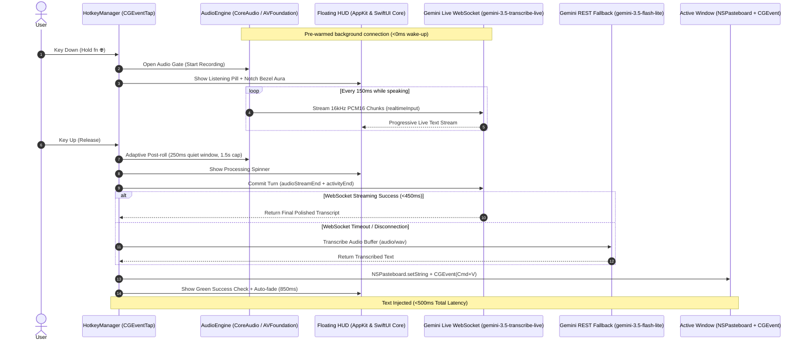

# JustSpeak 🎙️⚡

> **Ultra-Low-Latency Push-to-Talk macOS Voice Dictation & Text Polishing Engine**  
> *Native Swift • Apple CoreAudio Ring Buffer • Google Gemini Live WebSockets • Apple HIG Design*

> [!NOTE]
> **Built with Google / Gemini**: This project is built by a Googler as a technical demonstration and prototype showcasing ultra-low-latency bidirectional speech processing with Google's Gemini Live API. It is an independent open-source project and not an officially supported Google product.

---

## ⚡ Overview

**JustSpeak** is an ultra-fast, native macOS voice dictation tool engineered for zero-friction productivity. 

Hold down your global push-to-talk key (default: **fn 🌐**), speak naturally in English, Marathi, Hindi, or mixed code-switched speech, and release. JustSpeak streams 16kHz Linear PCM audio in real time directly to **Google Gemini 3.5 Transcribe Live** (`gemini-3.5-transcribe-live`) over bidirectional WebSockets, removes filler words (*um, uh, like*), normalizes numbers and dates, and injects polished text instantly into your active window via synthesized paste (`Cmd+V`) in **< 500ms**.

```
Hold [fn 🌐] ──► 🎙️ Audio Capture (16kHz PCM) ──► ⚡ Gemini Live STT ──► 📋 Cmd+V Paste (<500ms)
```

---

## ✨ Key Features

- **Hold to Lock**: For long dictations, keep holding — a ring traces the pill's rim and closes after `HOLD_TO_LOCK` seconds (default 12). The pill shows a padlock with *Release the key. Press again to finish.*: let go, keep talking, press the hotkey once more to paste. `LOCK_LIMIT` (default 120s) finishes a locked turn on its own so a forgotten mic never stays open.
- **Sub-500ms End-to-End Latency**: Audio chunks are streamed over persistent WebSockets while you speak, so Gemini receives and transcribes speech before you even release the hotkey.
- **Zero Clipping at Either End**: A 400ms always-on pre-roll ring buffer captures the syllable spoken *before* key-down, and an adaptive post-roll keeps streaming after release while speech energy persists (250ms continuous-quiet window, 1.5s hard cap) — releasing the key mid-syllable never clips the last word.
- **Apple HIG & Dynamic Island UI**:
  - **Notch Light Spill**: a soft pool of light beneath the notch that breathes with your voice — one Google color at a time, slowly cycling blue → red → yellow → green → white; success settles on green, errors on red.
  - **Halo Falloff**: the bezel (or, on notch-less displays, the pill capsule) is wrapped in a layered halo — a thin rim under two gaussian glows of different radii — so the light genuinely fades out with distance instead of ending at a stroke edge; speech swells both its width and its blur.
  - **Siri Orb & Living Equalizer**: Pulsing Apple Intelligence gradient orb with 4-bar dynamic audio visualizer.
  - **Dynamic Island Capsule**: Hardware-black floating HUD that reads as the notch extruding, rendered with Display P3 colors.
- **Apple System Earcons**: Pre-cached native macOS audio feedback on key-down, key-release, lock and text commit (`jbl_begin.caf`, `Pop.aiff`, `payment_success.aif`, `acknowledgment_sent.caf`); the release and lock cues are picked for enough transient energy to stay audible while the output is ducked.
- **Custom Vocabulary**: Domain terms, acronyms, team names, and tech stack jargon loaded from [`vocabulary.txt`](vocabulary.txt) or `.env`.
- **Bilingual & Code-Switching Support**: Built-in support for English (`en-IN`), Marathi (`mr-IN`), Hindi (`hi-IN`), and 80+ languages with automatic acoustic language detection.
- **Zero Unsigned Binaries (gMac Enterprise Compliant)**: Pure Swift script executed directly through Apple's signed `/usr/bin/swift` interpreter with zero third-party binary dependencies.
- **Resilient Fallback Routing**: Automatic, transparent failover to Gemini REST API (`gemini-3.5-flash-lite` / `gemini-3.5-transcribe`) on WebSocket disconnection or timeouts. Because the fallback *prompts* a general-purpose model to transcribe rather than calling a dedicated transcription model, its results pass through a validation gate first — an LLM asked to transcribe audio can answer or chat about it instead, and a rejected result is discarded rather than pasted. Silent clips never reach any API: a local frame-RMS scan counts 20ms speech-energy frames (immune to the hotkey's own click transient, which defeats simple peak detection), and when the Live model itself reports no speech in a low-energy clip, that verdict is trusted and the turn settles as empty instead of handing silence to the REST model to hallucinate over. Empty transcripts on real audio get one re-send (model nondeterminism), and 429 responses honor the server's `retryDelay`/`Retry-After` hint for a single retry before failing.
- **Edge-Case Aware**: Offline? Dictation refuses instantly at key-down ("No internet connection") instead of timing out 10s later. Invalid API key and wrong model names fail with the fix in the message. The mic engine rebuilds itself when the input device changes (AirPods in/out), the WebSocket reconnects after system wake, permissions revoked mid-session downgrade to clipboard-only with a pointer to the right Settings pane, and a lockfile prevents a second instance from double-pasting.

---

## 🔒 Security & Enterprise Santa Policy Compliance

JustSpeak was designed specifically for corporate gMac environments with strict security baselines:

- **Zero Compiled Binaries**: No external Mach-O binaries, `.dylib` shared libraries, or native Node.js addons (`node-gyp`).
- **Apple-Signed System Runtimes Only**: Executes purely via macOS system frameworks (`AVFoundation`, `CoreAudio`, `CoreGraphics`, `AppKit`) and `/usr/bin/swift`.
- **Zero External Dependencies**: Self-contained Swift implementation without package managers, CocoaPods, or dynamic linkers. Source lives in `src/*.swift`; the `./justspeak` runner concatenates it into one generated script (`.build/justspeak.gen.swift`) and interprets it with Apple-signed `/usr/bin/swift` — no compiled binary is ever produced, so Santa never has anything to block. `#sourceLocation` directives injected at file boundaries keep compiler diagnostics pointing at the real `src/` file and line.
- **Zero Local Audio Persistence**: Raw microphone audio is held in memory buffers during the keypress and discarded immediately after dispatch.

---

## 🏗️ Architecture



---

## 🚀 Quick Start

### 1. Prerequisites
- **macOS 13.0+** (Ventura, Sonoma, Sequoia, or later).
- **Apple Command Line Tools** (provides `/usr/bin/swift`):
  ```bash
  xcode-select --install
  ```

### 2. Clone & Setup
```bash
# Clone the repository
git clone https://github.com/adhishthite/justspeak.git
cd justspeak

# Initialize local .env configuration
make setup
```

### 3. Configure API Key
Open `.env` and add your Google Gemini API key ([Get an API key from Google AI Studio](https://aistudio.google.com/)):
```ini
GEMINI_API_KEY=AIzaSy...
```

### 4. Verify Permissions & Connectivity
```bash
# Verify Accessibility, Microphone, and Input Monitoring permissions
make check-permissions

# Verify API key reachability and latency
make test-api
```

### 5. Run JustSpeak
```bash
make run
```
*Or use the runner script:*
```bash
./justspeak
```

---

## ⚙️ Configuration Reference (`.env`)

All settings can be configured in `.env` or set as environment variables:

| Variable | Default | Description |
| :--- | :--- | :--- |
| `GEMINI_API_KEY` | *(empty)* | Google Gemini API Key (**Required**) |
| `GEMINI_LIVE_MODEL` | `gemini-3.5-transcribe-live` | Real-time WebSocket streaming model |
| `GEMINI_MODEL` | `gemini-3.5-flash-lite` | REST fallback STT model |
| `SMART_TRANSCRIPTION` | `true` | Real-time Inverse Text Normalization ($26M, dates, formatting) and disfluency removal |
| `LANGUAGE_CODES` | `en-IN,mr-IN` | Region-qualified BCP-47 codes from the live-transcribe language table (e.g. `en-IN,mr-IN`, `en-US`, or `auto` for unrestricted) |
| `CUSTOM_VOCABULARY` | *(empty)* | Comma-separated list of words/phrases to boost |
| `CUSTOM_VOCABULARY_FILE` | `vocabulary.txt` | File containing one word/phrase per line (`#` comments allowed) |
| `HOTKEY` | `fn` | Trigger key (`fn`, `right_option`, `left_option`, `right_control`, `left_control`, `right_cmd`, `left_cmd`, `f13`–`f20`, or a raw numeric keyCode) |
| `HOTKEY_MODE` | `push_to_talk` | `push_to_talk` (hold to speak) or `toggle` (press to start, press to stop) |
| `HOLD_TO_LOCK` | `12` | Seconds of holding after which the turn locks (rim ring closes, padlock shows): release freely, press the hotkey again to finish. `0` disables; ignored in `toggle` mode (0-60) |
| `LOCK_LIMIT` | `120` | Seconds a locked turn may run before it finishes on its own (0-600, `0` = no limit) |
| `SOUND_FEEDBACK` | `true` | Subtle Apple system earcons on start / commit |
| `RELEASE_SOUND` | `true` | Soft tick at key release acknowledging the hold ended while the transcript settles (needs `SOUND_FEEDBACK`) |
| `SHOW_HUD` | `true` | Native floating Dynamic Island capsule + notch light spill |
| `HUD_REVEAL` | `slide` | Pill entrance animation: `slide`, `bloom` (inflate from the notch), `drift` (subtle fade-drift), `unfurl` (unroll with settle-back), `morph` (Dynamic Island membrane — stretches out of the notch itself and detaches; needs a physical notch, falls back to `slide` otherwise). Preview with `make hud-demo` |
| `HUD_FOLLOW_FOCUS` | `true` | Show the HUD on the display holding the frontmost app's focused window (pointer as fallback); `false` pins it to the menu-bar/notch display |
| `HUD_PARTICLES` | `true` | Ambient light-dust drifting down from the notch while listening, breathing with your voice (off under Reduce Motion) |
| `PRIVACY_MODE` | `false` | Screen-share privacy: the pill is hidden entirely — the notch aura and earcons carry all feedback — and the terminal prints only a char count. Paste unaffected; history DB still records locally |
| `INPUT_DEVICE` | *(empty)* | Microphone to capture from: `auto` (built-in while the lid is open, external while closed), a CoreAudio UID, or a case-insensitive name substring (`studio`); empty = system default. `make list-inputs` shows candidates; the active device is logged at startup and stored per row (`input_device`, `input_transport`) |
| `DUCK_AUDIO` | `false` | Duck the system output volume while recording so speaker audio doesn't bleed into the mic (restored afterwards; a mid-turn manual volume change wins) |
| `DUCK_FRACTION` | `0.2` | Fraction of the current output volume kept while ducked (0.0-1.0) |
| `ENABLE_LIVE_WEBSOCKET` | `true` | Stream audio chunks via Live WebSockets (`true`) or REST only (`false`) |
| `REST_FALLBACK_TIMEOUT` | `4.0` | Maximum seconds to wait for WebSocket response before falling back to REST (`.env.example` ships `2.5`) |
| `PRE_ROLL_MS` | `400` | Always-on rolling ring buffer (ms) dispatched instantly at key-down so the first syllable is never clipped (0-1000) |
| `POST_ROLL_MS` | `250` | Adaptive trailing capture: continuous-quiet window (ms) after key release before the turn commits; audio keeps streaming while speech energy persists (0-500) |
| `POST_ROLL_MAX_MS` | `1500` | Hard cap (ms) on the adaptive trailing capture above; set equal to `POST_ROLL_MS` (or `0`) to disable adaptation (0-5000) |
| `TRAIL_SILENCE_DB` | `-40.0` | RMS dBFS below which the mic is considered quiet for the adaptive trailing capture above (-80.0 to -10.0) |
| `VAD_MODE` | `manual` | `manual` (push-to-talk hold defines speech bounds, server VAD off), `tuned` (pause-tolerant server VAD), `auto` (stock server VAD) |
| `VAD_SILENCE_MS` | `1500` | Tuned mode only: pause length (ms) before server VAD ends speech (200-5000) |
| `WS_ENDPOINT_ALIGNED` | `false` | A/B: send only the documented end-of-turn signal for transcribe models (manual VAD → `activityEnd`; auto/tuned → `audioStreamEnd`) instead of the legacy three-signal commit |
| `CHUNK_MS` | `150` | A/B: streaming frame size (ms) for Live WebSocket audio, pre-roll included; docs suggest ~100 for the dedicated transcribe model (20-500) |
| `SILENCE_FLUSH_MS` | `700` | A/B: synthetic trailing silence (ms) appended after key-up for the encoder's lookahead window; `0` disables (0-2000) |
| `MIC_IDLE_TIMEOUT` | `300` | Seconds without a dictation before the mic is released (status-bar indicator off); next key-down re-arms it. `0` = always on |
| `HISTORY` | `true` | Record every dictation (success, empty, or error) as one row in a local SQLite DB for later analysis |
| `HISTORY_DB` | *(empty)* | Path to the history SQLite DB. Empty = `~/.justspeak/history.db` |
| `ANALYZE_MODEL` | `gemini-3.7-flash` | Model used by `make analyze` to mine the history (runs rarely and offline, so a stronger model is affordable). Empty = use `GEMINI_MODEL` |
| `ANALYZE_CONTEXT` | *(empty)* | One line describing who is dictating, injected into the `make analyze` prompt so it can judge what a garbled phrase meant. Also settable as a `# context:` line in the vocabulary file (the env knob wins) |
| `LEARN_CORRECTIONS` | `false` | Opt-in: after each paste, read the focused field back once (Accessibility API) and record single-word edits you typed ("cloud" → "Claude") as ground truth for `make analyze`. Only the changed word pairs are stored, never field content; heavily gated against false positives |
| `LEARN_DELAY_MS` | `8000` | Paste-to-read-back delay (ms) for `LEARN_CORRECTIONS`; a new dictation before it fires cancels the read (2000-60000) |
| `LIVE_INPUT_PRICE_PER_1M` | `3.50` | USD per 1M audio input tokens for the live model (cost diagnostics only) |
| `LIVE_OUTPUT_PRICE_PER_1M` | `21.00` | USD per 1M text output tokens for the live model (cost diagnostics only) |
| `REST_INPUT_PRICE_PER_1M` | `0.30` | USD per 1M input tokens for the REST fallback model (cost diagnostics only) |
| `REST_OUTPUT_PRICE_PER_1M` | `2.50` | USD per 1M output tokens for the REST fallback model (cost diagnostics only) |
| `RESTORE_CLIPBOARD` | `true` | Automatically restore previous clipboard contents ~1s after injection, only if nothing else has written the clipboard in the meantime |
| `TRAILING_SPACE` | `true` | Append one space after each injected dictation so back-to-back dictations don't fuse |
| `LOG_LEVEL` | `verbose` | `verbose` (live dB meters & latency diagnostics) or `normal` |

---

## 📖 Custom Vocabulary & Technical Jargon

Boost speech recognition accuracy for technical libraries, proper nouns, code symbols, and teammate names:

### Option A: `vocabulary.txt` (Recommended)
JustSpeak automatically reads [`vocabulary.txt`](vocabulary.txt) from the workspace. Lines starting with `#` and blank lines are ignored:

```text
# Team & Names
Adhish
Kunal
JustSpeak

# AI & Machine Learning
LangGraph
LangChain
FastAPI
Vertex AI
BigQuery
TensorFlow
PyTorch
RAG
LLM
MCP

# Cloud & Infrastructure
Kubernetes
Docker
Next.js
TypeScript
Biome
PostgreSQL
Redis
RabbitMQ
gRPC
WebSockets
```

### Option B: Inline in `.env`
```ini
CUSTOM_VOCABULARY="Adhish, Kunal, LangGraph, Vertex AI, Kubernetes, FastAPI"
```

### Text Replacements

Any vocabulary line or item containing `=>` is a deterministic **replacement rule** instead of a plain boost term:

```text
cooper netties => Kubernetes
```

`wrong` and `right` are trimmed independently; either side being empty drops the rule. These rules are enforced client-side, deterministically, right after transcription — unlike plain boost terms, which only bias what the recognizer *might* hear, a replacement rule guarantees the wrong form never reaches your document. The `right` side is also added to the boost vocabulary automatically (never the `wrong` form — that would just teach the recognizer to keep mishearing it the same way).

### Vocabulary Mining (`make analyze`)

Instead of noticing misrecognitions one by one, let the model read your history:

```bash
make analyze                      # last 30 days
./justspeak --analyze --days 7    # custom window
```

The analyzer pulls your successful dictations from the local history DB (newest first, capped at 500 turns) — each with its timestamp and the app it was dictated into — and sends them **once** to `ANALYZE_MODEL` (`gemini-3.7-flash` by default). It asks for two things: domain terms you say repeatedly that a recognizer is likely to mangle (→ boost terms), and misrecognitions of what you actually meant (→ `wrong => right` rules). Your existing vocabulary is the primary hunting list for the latter — "cloud code" is caught *because* "Claude Code" is in your vocabulary — and near-identical dictations seconds apart are pre-detected as re-dictation pairs, whose differing words are direct correction evidence. A `# context:` line in your vocabulary file (or `ANALYZE_CONTEXT`) describing who you are sharpens the guesses. Duplicate suggestions are filtered, rules are capped at 4 words per side and never proposed for grammar/punctuation/capitalization-only differences, and each suggestion comes with its evidence. Nothing is written unless you answer `y` to the final prompt, which appends the suggestions to your vocabulary file under a dated `# Added by --analyze` comment — they take effect on the next launch.

This is strictly on-demand: the dictation pipeline never runs it, and your transcripts go exactly where they already went to be transcribed — the same Gemini API, same key.

With `LEARN_CORRECTIONS=true`, the analyzer also gets **ground truth**: after each paste, JustSpeak reads the focused field back once (via the Accessibility permission the paste already uses) and diffs it against what it pasted. If you typed over a misrecognized word — "cloud" → "Claude" — that word pair (and nothing else: never the field content) lands in a local `corrections` table, and the next `make analyze` proposes it as a rule with the evidence attached. The capture is strict on purpose: single-word swaps of ≥3 characters, no grammar or capitalization-only fixes, the replacement must look like a proper noun or already be in your vocabulary, and it must be phonetically plausible (edit-distance band). Apps that don't expose their text through accessibility — most terminals, some Electron apps — silently contribute nothing, which is exactly why the transcript-mining above exists as the universal path.

---

## 🌐 Multilingual & Bilingual Support

JustSpeak supports over 80 languages with native code-switching support:

- **Configured Languages**: Priority language codes can be set in `.env`:
  ```ini
  # English and Marathi
  LANGUAGE_CODES=en-IN,mr-IN
  
  # English, Hindi, and Marathi
  LANGUAGE_CODES=en-IN,hi-IN,mr-IN
  
  # Unrestricted Automatic Language Detection (All 80+ languages)
  LANGUAGE_CODES=auto
  ```
- **Code-Switching**: Speak natural bilingual sentences (e.g. Marathi with English technical terms like *"मी LangGraph वापरून नवीन pipeline बनवली आहे"*).

---

## ⌨️ Hotkey Options & KeyCodes

| Key Alias | Target Hardware Key | macOS KeyCode |
| :--- | :--- | :--- |
| `fn` | **Function / Globe Key (🌐)** *(Default)* | `63` |
| `right_option` | Right Option / Alt (⌥ Right) | `61` |
| `left_option` | Left Option / Alt (⌥ Left) | `58` |
| `right_control` | Right Control (⌃ Right) | `62` |
| `left_control` | Left Control (⌃ Left) | `59` |
| `right_cmd` | Right Command (⌘ Right) | `54` |
| `left_cmd` | Left Command (⌘ Left) | `55` |
| `f13` … `f20` | F13–F20 Keys | `0x69`, `0x6B`, `0x71`, `0x6A`, `0x40`, `0x4F`, `0x50`, `0x5A` |
| *(any number)* | Raw macOS keyCode | *(as given)* |

> [!TIP]
> **Using `fn`**: macOS also acts on the Globe key itself, so set **System Settings → Keyboard → "Press 🌐 key to" → Do Nothing**, and disable Apple Dictation's Fn shortcut (**Keyboard → Dictation**) to avoid triggering Apple's own dictation. Some external keyboards handle Fn in firmware and never send keyCode 63 — use an F-key there instead.

---

## 🔐 macOS Permissions Guide

JustSpeak requires three standard macOS permissions to monitor global hotkeys, record audio, and paste text:

1. **Accessibility** (`AXIsProcessTrusted`):
   - Navigate to **System Settings → Privacy & Security → Accessibility**.
   - Enable your host terminal application (**Terminal**, **iTerm2**, **VS Code**, **Cursor**, or **Ghostty**).
2. **Input Monitoring**:
   - Navigate to **System Settings → Privacy & Security → Input Monitoring**.
   - Enable your host terminal application.
3. **Microphone**:
   - Navigate to **System Settings → Privacy & Security → Microphone**.
   - Allow your terminal when prompted.

Run permission diagnostics anytime:
```bash
make check-permissions
```

**Paste safety:** if secure input is held (a password field, Terminal's Secure Keyboard Entry) or the frontmost app changes mid-dictation, JustSpeak never synthesizes a paste into the wrong place — it copies the transcript to the clipboard instead and prompts you to press ⌘V.

---

## 📊 Latency Diagnostics & Observability

Every dictation turn outputs a full breakdown of roundtrip latency and transport routing:

```text
[00:11:09.671] 🎙️  RECORDING [████░░░░░░░░] -34.5 dB | 11.03s | 290.6 KB streamed (#87)
[00:11:09.844] [AUDIO] Captured 11.21s audio (88 chunks, 315.7 KB). Committing turn...
[00:11:10.291] ⚡ DICTATING [447ms]: This is a good test of the Gemini 3.5 transcribe live model.

─── Transcribed & Polished Text ─────────────────────────────
This is a good test of the Gemini 3.5 transcribe live model.
─────────────────────────────────────────────────────────────

📊 Latency Diagnostic Breakdown:
  • Primary Route:       Live WebSocket (gemini-3.5-transcribe-live)
  • Fallback Used:       NO (Direct Live Stream Complete)
  • Audio Duration:      11.21s
  • API Roundtrip (RTT): 449.0 ms
  • Injection Latency:   50.0 ms (Pasted via Cmd+V)
  • Total Key-Up → Paste: 499.1 ms ⚡
```

If a fallback occurs (e.g. network timeout or socket disconnect), JustSpeak logs the exact failover reason:
```text
📊 Latency Diagnostic Breakdown:
  • Primary Route:       REST API (gemini-3.5-flash-lite)
  • Fallback Used:       YES ⚠️ [REST Fallback Route Invoked]
  • Fallback Reason:     WebSocket Settlement Timeout (> 4.5s)
  • Fallback Model:      gemini-3.5-flash-lite
  • Audio Duration:      3.20s
  • API Roundtrip (RTT): 1240.5 ms
  • Injection Latency:   4.3 ms (Pasted via Cmd+V)
  • Total Key-Up → Paste: 1244.8 ms ⚡
```

---

## 🗄️ Dictation History

Every dictation turn (success, empty, or error) is written as one row to a local SQLite database
at `~/.justspeak/history.db` (`HISTORY_DB` to override, `HISTORY=false` to disable). It's plaintext
on disk, mode `0600`, and never leaves your machine — use it to run your own cost/latency analytics:

```bash
# Total cost per day
sqlite3 ~/.justspeak/history.db \
  "SELECT date(ts_utc), COUNT(*), ROUND(SUM(cost_usd),4) FROM transcriptions WHERE outcome='success' GROUP BY 1 ORDER BY 1 DESC;"

# Words dictated per day
sqlite3 ~/.justspeak/history.db \
  "SELECT date(ts_utc), SUM(word_count) FROM transcriptions GROUP BY 1 ORDER BY 1 DESC;"

# Average / worst-case total latency
sqlite3 ~/.justspeak/history.db \
  "SELECT ROUND(AVG(total_ms),1), MAX(total_ms) FROM transcriptions WHERE outcome='success';"

# Plain release vs hold-to-lock turns (finish_mode: release / lock_press / lock_limit)
sqlite3 ~/.justspeak/history.db \
  "SELECT COALESCE(finish_mode,'release'), COUNT(*), ROUND(AVG(audio_seconds),1), ROUND(AVG(word_count),1) FROM transcriptions WHERE outcome='success' GROUP BY 1;"

# Which microphone each dictation used (built-in vs display/USB/Bluetooth)
sqlite3 ~/.justspeak/history.db \
  "SELECT input_device, input_transport, COUNT(*) FROM transcriptions GROUP BY 1,2 ORDER BY 3 DESC;"

# Which apps you dictate into (frontmost app at key-down)
sqlite3 ~/.justspeak/history.db \
  "SELECT app_name, COUNT(*), SUM(word_count) FROM transcriptions WHERE outcome='success' GROUP BY 1 ORDER BY 2 DESC;"
```

---

## 🛠️ Makefile Commands

| Target | Description |
| :--- | :--- |
| `make run` | Start the JustSpeak push-to-talk dictation tool |
| `make check-permissions` | Validate Accessibility, Microphone & Input Monitoring permissions |
| `make test-api` | Verify Gemini API connectivity, model reachability & latency |
| `make test-audio` | Record a 3-second audio sample from the mic and verify AI transcription |
| `make list-inputs` | List capture devices (names/UIDs for `INPUT_DEVICE`, default marked) |
| `make analyze` | Mine your dictation history for vocabulary suggestions (interactive) |
| `make setup` | Initialize local `.env` configuration from `.env.example` |
| `make lint` | Lint `src/*.swift` with Apple's `swift format` (Xcode 16+; read-only) |
| `make format` | Rewrite `src/*.swift` in place with Apple's `swift format` |
| `make clean` | Clean temporary files and caches |
| `make help` | Display all available Makefile targets |

---

## 🏛️ Disclaimer

This is a personal open-source demonstration project developed by a Googler to showcase real-time voice dictation with Google Gemini Live WebSockets (`gemini-3.5-transcribe-live`). This repository is intended as an architectural reference and demo. It is not an officially supported Google product and is distributed "as is" without warranty.

---

## 📄 License

Apache License 2.0. See [LICENSE](LICENSE) for details.
